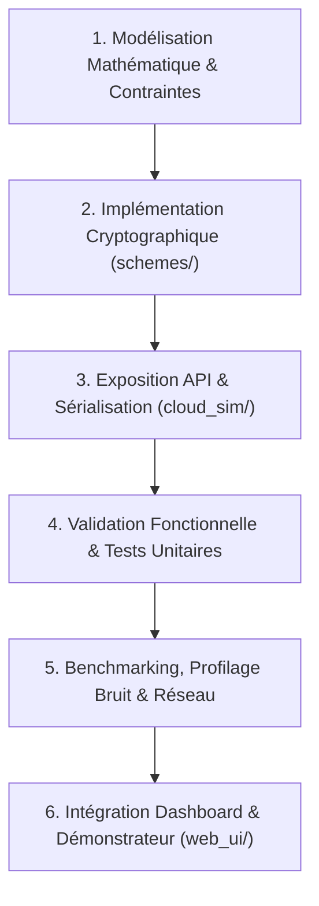
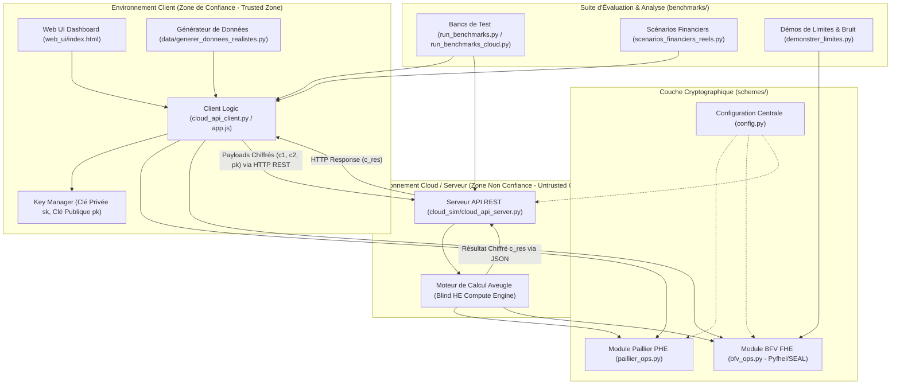
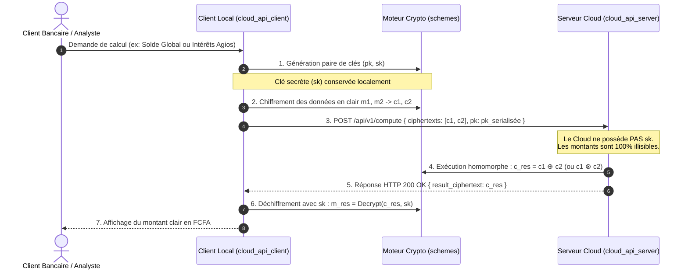
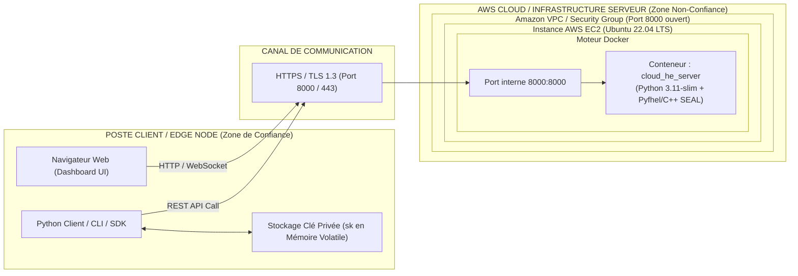

# Guide d'Ingénierie, Architecture Logicielle et Architecture Physique : Projet HE_Proto

Ce document constitue la **référence d'ingénierie logicielle et d'architecture système** pour le prototype de Chiffrement Homomorphe Appliqué à la Banque et au Mobile Money (**HE_Proto**).

---

## 📋 Sommaire

1. [Vue d'Ensemble & Contexte Métier](#1-vue-densemble--contexte-métier)
2. [Structure de Travail & Méthodologie d'Ingénierie (Workflow Développeur)](#2-structure-de-travail--méthodologie-dingénierie-workflow-développeur)
   * 2.1 Prérequis et Environnement de Développement
   * 2.2 Cycle de Développement en 6 Étapes (Workflow Feature)
   * 2.3 Règles d'Or Cryptographiques & Bonnes Pratiques
3. [Architecture Logicielle du Projet (Architecture Applicative)](#3-architecture-logicielle-du-projet-architecture-applicative)
   * 3.1 Découpage Modulaire & Responsabilités
   * 3.2 Diagramme de l'Architecture Logicielle
   * 3.3 Flux de Données & Cycle de Vie d'une Requête Homomorphe
4. [Architecture Physique & Infrastructure de Déploiement](#4-architecture-physique--infrastructure-de-déploiement)
   * 4.1 Modèle de Sécurité & Frontière de Confiance (Threat Model)
   * 4.2 Diagramme d'Architecture Physique (Edge / Cloud / Docker)
   * 4.3 Matrice des Nœuds, Réseaux et Ressources Matérielles
   * 4.4 Dimensionnement Matériel Recommandé (Sizing)
5. [Stratégie de Tests, Validation Mathématique & Benchmarks](#5-stratégie-de-tests-validation-mathématique--benchmarks)

---

## 1. Vue d'Ensemble & Contexte Métier

Le projet **HE_Proto** implémente une solution de calcul bancaire externalisé sur le Cloud sans divulgation des données sensibles (soldes, transactions, micro-crédits, agios en FCFA), grâce au **Chiffrement Homomorphe** :

* **PHE (Partially Homomorphic Encryption)** via le schéma **Paillier** (2048 / 3072 bits) : supporte l'addition de chiffrés et la multiplication par un scalaire clair.
* **FHE (Fully Homomorphic Encryption)** via le schéma **BFV** (Microsoft SEAL / Pyfhel) : supporte les additions et multiplications entre données chiffrées avec gestion du bruit (*noise budget*).

---

## 2. Structure de Travail & Méthodologie d'Ingénierie (Workflow Développeur)

### 2.1 Prérequis et Environnement de Développement

L'ingénieur logiciel doit impérativement configurer un environnement reproductible :

* **Python** : Version **3.11** recommandée (obligatoire pour la compilation et les roues binaires de `Pyfhel` / Microsoft SEAL C++).
* **Compilateurs C++ & Outils de Build** : `CMake` (>= 3.15), MSVC C++ Build Tools (Windows) ou GCC/Clang (Linux/macOS).
* **Mise en place de l'environnement virtuel** :
  ```bash
  python -m venv venv
  # Activation :
  # Windows PowerShell : .\venv\Scripts\Activate.ps1
  # Linux/macOS : source venv/bin/activate
  pip install --upgrade pip setuptools wheel
  pip install -r requirements.txt
  ```

---

### 2.2 Cycle de Développement en 6 Étapes (Workflow Feature)

Pour toute nouvelle fonctionnalité (ex: calcul d'un score de solvabilité chiffré, détection de fraude, prélèvement d'agios), l'ingénieur doit appliquer le cycle suivant :



1. **Modélisation Mathématique & Contraintes** :
   * Décomposer la règle métier en opérations primitives ($+, -, \times k, \times$).
   * Choisir le schéma adéquat : Paillier (faible latence, profondeur multiplicative = 0) ou BFV (profondeur multiplicative $> 0$).
   * Quantification des montants : convertir les valeurs monétaires décimales en entiers (centimes de FCFA) pour respecter l'arithmétique modulaire des chiffreurs homomorphes.
2. **Implémentation Cryptographique ([schemes/](file:///c:/Users/PADSEM/HE_Proto/schemes))** :
   * Développer ou enrichir les wrappers dans `paillier_ops.py` ou `bfv_ops.py`.
   * Gérer la linéarisation des polynômes (*relinearization keys*) lors des multiplications BFV.
3. **Exposition API & Sérialisation ([cloud_sim/](file:///c:/Users/PADSEM/HE_Proto/cloud_sim))** :
   * Ajouter les routes REST dans `cloud_api_server.py`.
   * Assurer une sérialisation compacte (Base64 / Hexadécimal / binaire natif) pour le transport HTTP.
4. **Validation Fonctionnelle & Tests Unitaires** :
   * Vérifier mathématiquement : $\text{Déchiffrer}(\text{CalculSurChiffré}(c_1, c_2)) \equiv \text{CalculSurClair}(m_1, m_2)$.
   * Tester les cas extrêmes : valeurs négatives, débordement du modulo clair $t$, épuisement du budget de bruit.
5. **Benchmarking & Profilage ([benchmarks/](file:///c:/Users/PADSEM/HE_Proto/benchmarks))** :
   * Mesurer les 4 métriques fondamentales : temps CPU, consommation RAM, taille du payload réseau (expansion de chiffrement), et niveau de bruit restant (`noise_level`).
6. **Intégration Frontend ([web_ui/](file:///c:/Users/PADSEM/HE_Proto/web_ui))** :
   * Ajouter les visualisations et interactions dans le tableau de bord web pour les démonstrations métiers.

---

### 2.3 Règles d'Or Cryptographiques & Bonnes Pratiques

* **Zero-Knowledge Serveur** : La clé privée ($sk$) ne doit **jamais** être transmise, sérialisée ou injectée sur le serveur Cloud. Seules la clé publique ($pk$) et la clé de rélinéarisation ($rlk$) sont partagées.
* **Surveillance du Noise Budget (BFV)** :
  Chaque multiplication homomorphe consomme du bruit. Si le budget tombe à 0 bit, le déchiffrement retourne un résultat corrompu. Calibrer `BFV_POLY_MODULUS_DEGREE` (ex: 8192) et `plain_modulus` dans [config.py](file:///c:/Users/PADSEM/HE_Proto/config.py).
* **Parallélisme & Batching SIMD** :
  Exploiter le mécanisme de *slots* BFV pour chiffrer un vecteur de transactions dans un seul ciphertext plutôt que de traiter les transactions de manière séquentielle unitaire.

---

## 3. Architecture Logicielle du Projet (Architecture Applicative)

### 3.1 Découpage Modulaire & Responsabilités

L'architecture logicielle est organisée selon le principe de séparation stricte des responsabilités (*Separation of Concerns*) :

```text
HE_Proto/
├── config.py                       # Paramétrage global (tailles de clés, seuils FCFA, réseau)
├── schemes/                        # Coeur cryptographique homomorphe
│   ├── paillier_ops.py             # Primitives PHE (chiffrement, additions, homomorphisme partiel)
│   └── bfv_ops.py                  # Primitives FHE (Pyfhel/SEAL, gestion du bruit, rélinéarisation)
├── cloud_sim/                      # Couche API et Serveur Cloud Aveugle
│   ├── cloud_api_server.py         # Serveur REST HTTP natif (moteur de calcul homomorphe distant)
│   ├── cloud_api_client.py         # Client HTTP pour l'envoi et la réception de chiffrés
│   └── local_server.py             # Moteur de simulation en mémoire locale
├── benchmarks/                     # Bancs de mesure et validation scientifique
│   ├── run_benchmarks.py           # Mesures CPU / Mémoire / Précision
│   ├── run_benchmarks_cloud.py     # Mesures en conditions réelles avec latence réseau
│   ├── demonstrer_limites.py       # Démonstration des limites (bruit BFV, non-multiplication Paillier)
│   └── scenarios_financiers_reels.py # Cas d'usage réels (Agios, Scoring Micro-Crédit)
├── data/                           # Génération et stockage de jeux de données bancaires FCFA
│   └── generer_donnees_realistes.py
└── web_ui/                         # Tableau de bord interactif Corporate
    ├── index.html                  # Interface utilisateur Web
    ├── style.css                   # Design system corporate bancaire
    └── app.js                      # Logique client & visualisation temps réel
```

---

### 3.2 Diagramme de l'Architecture Logicielle



---

### 3.3 Flux de Données & Cycle de Vie d'une Requête Homomorphe



---

## 4. Architecture Physique & Infrastructure de Déploiement

### 4.1 Modèle de Sécurité & Frontière de Confiance (Threat Model)

L'architecture physique repose sur une séparation hermétique en deux zones d'isolation réseau et matérielle :

1. **Zone de Confiance (Client Edge / On-Premise)** :
   * Détenue par la banque ou l'utilisateur final.
   * Contient les données en clair, la clé secrète ($sk$) et l'algorithme de déchiffrement.
2. **Zone Distante / Non-Confiance (Cloud Provider / AWS EC2)** :
   * Exécute le conteneur Docker `cloud_he_server`.
   * Considérée comme un adversaire passif mais curieux (*Honest-but-Curious*) : exécute fidèlement les calculs mais ne doit en aucun cas pouvoir lire le contenu des comptes bancaires.

---

### 4.2 Diagramme d'Architecture Physique



---

### 4.3 Matrice des Nœuds, Réseaux et Ressources Matérielles

| Nœud / Composant | Rôle Système | Technologie / Runtime | Ports / Protocoles | Exigences Sécurité |
| :--- | :--- | :--- | :--- | :--- |
| **Poste Client (Edge)** | Génération de clés, chiffrement, visualisation | Python 3.11 / Web Browser | Sortant : TCP 8000 (HTTP/HTTPS) | Détention exclusive de la clé privée `sk`. |
| **Canal Réseau** | Transport des payloads chiffrés | WAN / Internet / VPN | Chiffrement en transit (TLS/HTTPS) | Protection contre interception et rejeu. |
| **Hôte Cloud (EC2)** | Hébergement de l'environnement conteneurisé | Linux Ubuntu 22.04 LTS / Docker | Entrant : TCP 22 (SSH restreint), TCP 8000 | Security Group AWS filtré, accès IAM restreint. |
| **Conteneur Docker** | Traitement homomorphe des requêtes REST | `cloud_he_server` (Python 3.11-slim) | Écoute sur `0.0.0.0:8000` | Aucune persistance de clés secrètes en base. |

---

### 4.4 Dimensionnement Matériel Recommandé (Sizing)

Le chiffrement homomorphe impose des exigences matérielles spécifiques en raison de la complexité polynomiale des calculs et de l'expansion de taille des données :

* **Serveur Cloud (Nœud de Calcul)** :
  * **CPU** : 4 à 8 cœurs haute fréquence (instructions vectorielles AVX2 / AVX-512 hautement recommandées pour accélérer les opérations polynomiales de SEAL/Pyfhel).
  * **RAM** : Minimum 8 Go (16 Go recommandé pour le traitement par lots BFV SIMD).
  * **Réseau** : Bande passante $\ge 1\text{ Gbps}$ (un ciphertext BFV sérialisé peut peser de quelques centaines de Ko à plusieurs Mo par lot).
* **Instance AWS EC2 Types Recommandés** :
  * Démarrage / Tests : `t3.xlarge` (4 vCPU, 16 GiB RAM).
  * Production / Benchmarks intensifs : `c5.2xlarge` ou `c6i.2xlarge` (Compute-Optimized, instructions AVX-512).

---

## 5. Stratégie de Tests, Validation Mathématique & Benchmarks

Pour garantir l'intégrité du système, l'ingénieur doit exécuter les vérifications suivantes :

1. **Validation Mathématique Croisée** :
   ```bash
   python -m unittest discover -s tests
   ```
2. **Exécution des Scénarios Métier Réels** :
   ```bash
   python benchmarks/scenarios_financiers_reels.py
   ```
3. **Validation des Limites Cryptographiques** :
   ```bash
   python benchmarks/demonstrer_limites.py
   ```
4. **Benchmark Complet Local vs Cloud** :
   ```bash
   python benchmarks/run_benchmarks.py
   python benchmarks/run_benchmarks_cloud.py
   ```
5. **Vérification du Déploiement Conteneurisé** :
   ```bash
   docker-compose up --build -d
   curl -I http://localhost:8000/
   ```
